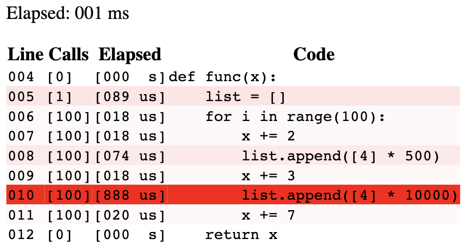

# pfhm (Python Function HeatMap tool)

Mini line-by-line timing tool made for debugging functions in Python.

This is not designed to be used as a large scale profiling tool - rather as a quick debugging of small functions.

## Usage

Install via `python setup.py install`.

See `example.py` for a full example.

Either use as a decorator,

```python
from pfhm import profile_func


@profile_func()
def func(*args, **kwargs):
	...
```

Where the output will be written to `out.html`, or inline,

`profile_func(func, out_file='custom_location.html')(*args, **kwargs)`.

## Example

As in `example.py`, we call the function

```python
@profile_func
def func(x):
	list = []
	for i in range(100):
		x += 2
		list.append([4] * 500)
		x += 3
		list.append([4] * 10000)
		x += 7
	return x
```

And receive the output:



